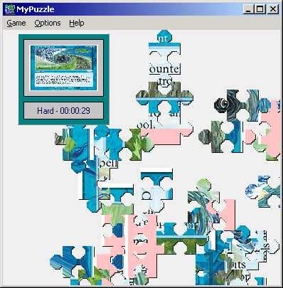



## MyPuzzle

### Description

This code show you how to do a GDI programming to create a desktop game. The game provides a solution to create on-fly transparent effect pattern. User will be able to drag and drop pattern to complete puzzle. Puzzle can be created from any picture image. You can save and load your game too.
 
### More Info
 

             |
---                |---
**Submitted On**   |2003-03-13 12:15:14
**By**             |[antonukdw](https://github.com/Planet-Source-Code/PSCIndex/blob/master/ByAuthor/antonukdw.md)
**Level**          |Intermediate
**User Rating**    |5.0 (55 globes from 11 users)
**Compatibility**  |VB 3\.0, VB 4\.0 \(16\-bit\), VB 4\.0 \(32\-bit\), VB 5\.0, VB 6\.0
**Category**       |[Games](https://github.com/Planet-Source-Code/PSCIndex/blob/master/ByCategory/games__1-38.md)
**World**          |[Visual Basic](https://github.com/Planet-Source-Code/PSCIndex/blob/master/ByWorld/visual-basic.md)
**Archive File**   |[MyPuzzle1560653162003\.zip](https://github.com/Planet-Source-Code/antonukdw-mypuzzle__1-43949/archive/master.zip)

